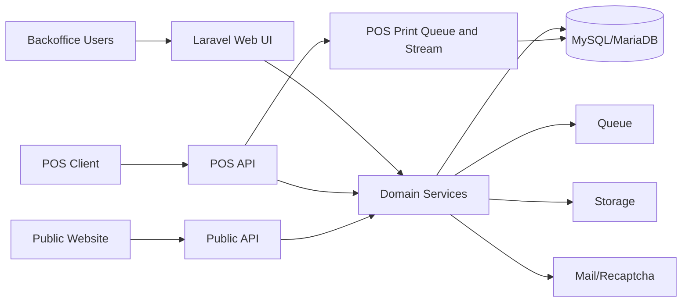
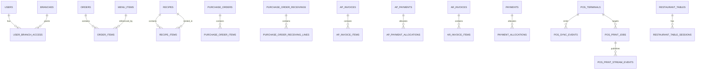

# RMS-1 Complete System Documentation

Updated for current codebase state on 2026-03-19.

## 1. SYSTEM OVERVIEW

### High-level description of the system
RMS-1 is a production-grade restaurant and finance management platform built as a Laravel modular monolith. It supports operations (orders, kitchen, daily dish, subscriptions, inventory), finance (AR, AP, spend approvals, petty cash, ledger), public ordering channels, and offline-first POS synchronization.

### Business goals of the platform
- Centralize restaurant operations and finance in one platform.
- Improve process control and auditability across departments.
- Support branch-based access and governance.
- Enable reliable offline POS workflows with server reconciliation.
- Provide management-ready reporting and exports.

### Key problems the system solves
- Fragmented order/inventory/finance workflows.
- Lack of end-to-end financial traceability from operations.
- Weak role governance and branch segregation.
- Manual reconciliation and duplicated data entry.
- Uncontrolled expense approvals and poor audit trails.

### Core features
- Identity and Access Management (roles, permissions, branch allowlists).
- Order lifecycle and kitchen workflow management.
- Daily Dish and subscription-based meal operations.
- Company Food standalone project ordering module.
- Inventory management with adjustments, manual stock transactions, transfers, and transaction history.
- Purchasing and receiving workflows with receiving-batch history and AP integration.
- AP invoice/payment lifecycle and aging summaries.
- Spend module with staged approvals and settlement.
- Petty cash wallet, issues, and reconciliation workflows.
- AR invoice/payment lifecycle for receivables, including admin-only payment deletion with reversals.
- Recipe composition with nested sub-recipes and cycle protection.
- Offline-first POS bootstrap/sequence/sync APIs and terminal-to-terminal print job relay.
- Reporting with screen/print/CSV/PDF outputs, including receiving, supplier purchase, and inventory transaction reports.
- Ledger and finance lock controls.

### Target users
- Administrators
- Managers
- Cashiers
- Waiters
- Kitchen users
- Finance/Staff users
- External public users (website ordering)

### System capabilities
- Multi-branch operations with branch-level enforcement.
- Token-based and session-based authentication.
- Event idempotency for POS sync.
- Public API integration for website channels.
- Config-driven reporting and pricing rules.

### Constraints and assumptions
- Single application and shared relational database.
- No separate mobile codebase inside this repository (POS client is external).
- Current schema is migration-driven; `schema.sql` may lag latest migrations.
- Legacy expenses API has been deprecated in favor of Spend/AP workflow.

---

## 2. SYSTEM ARCHITECTURE

### Architecture style
Modular monolith (single Laravel deployment with domain-segmented services/modules).

### High level architecture diagram description
- Web users access Blade/Livewire pages.
- Internal APIs serve authenticated module operations.
- Public APIs serve daily dish/company food external channels.
- POS clients use dedicated `/api/pos/*` endpoints with offline sync and print-job relay.
- Shared services persist to MySQL and write accounting/audit records.



### Core architectural principles
- Service-layer business logic.
- Validation-first request handling.
- Transactional state transitions.
- Defense in depth for authz (role + permission + branch).
- Idempotent POS event processing via UUID keys.
- Immutable rules for posted accounting artifacts.

### Infrastructure overview
- Laravel 12 app runtime (PHP 8.2+).
- Vite/Tailwind asset pipeline.
- MySQL/MariaDB data store.
- Database queue/cache defaults.
- Filesystem abstraction (local/public/S3).
- Server-sent event stream support for POS print dispatch.

### Service interactions
- Controllers delegate to services for workflows.
- Services coordinate cross-domain updates (e.g., PO receive -> inventory + receiving history + AP draft).
- POS sync service dispatches type-specific handlers and returns ACK + deltas.
- POS print service manages enqueue, claim, retry, ACK, and terminal heartbeat status.

### Data flow overview
1. Request arrives via web/internal API/public API/POS API.
2. Auth + middleware enforcement.
3. Request validation.
4. Service-layer workflow execution (transactional).
5. Persistence + optional accounting events.
6. Response payload / exports / ACK and deltas.

### External dependencies
- SMTP mail provider.
- Google reCAPTCHA verification endpoint (optional).
- Optional AWS S3-compatible storage.
- External website integration via public APIs and proxy scripts.

### Scalability considerations
- Horizontal app scaling with stateless web nodes.
- Dedicated queue workers for background processing.
- POS/event-heavy paths use row locking for consistency.
- POS print streaming and pull endpoints rely on lightweight terminal heartbeats and claim windows instead of heavy broker infrastructure.
- Read-heavy reports rely on indexing and can be moved to replicas.

### Security architecture
- Fortify login with rate limiting.
- Sanctum token auth for POS and selected APIs.
- Spatie roles/permissions and middleware enforcement.
- Branch access middleware for data scoping.
- POS token middleware validates device/terminal/branch alignment.
- POS print jobs use terminal-bound claims plus per-job claim tokens before ACK is accepted.

---

## 3. TECH STACK

| Layer | Technology | Why used |
|---|---|---|
| Frontend | Blade + Livewire Volt + Flux + Tailwind + Vite | Fast server-driven UI with low SPA complexity |
| Backend | Laravel 12, PHP 8.2+, domain services | Mature framework, strong ecosystem, maintainability |
| Mobile/POS | External Flutter client integrated via POS API | Offline-first POS support with sync contracts |
| Database | MySQL/MariaDB (SQLite support) | Transactional integrity for finance/operations |
| Cloud/Infra | App server + DB + workers (+ optional Redis) | Fits modular monolith deployment model |
| Authentication | Fortify (web), Sanctum (token), custom POS token middleware | Secure user and device-bound API access |
| File storage | Laravel Filesystems (`local`,`public`,`s3`) | Portable storage backend support |
| Messaging/queues | Laravel Queue (database default) | Async processing and workflow decoupling |
| Monitoring | Monolog/Laravel logging (+ optional Nightwatch package) | Operational visibility and diagnostics |
| CI/CD | GitHub Actions, Pest, Pint | Automated testing and style quality gates |

---

## 4. MODULE ARCHITECTURE

### Authentication & IAM
- **Purpose:** Centralize identity, role, and permission governance.
- **Responsibilities:** User lifecycle, role assignment, direct permissions, branch allowlists, POS eligibility.
- **Internal components:** `IamUserService`, `RolePermissionService`, `SafetyPolicyService`, IAM pages.
- **Inputs/Outputs:** User/role payloads -> persisted access model and enforcement outcomes.
- **Dependencies:** Spatie Permission, branch access middleware.
- **Data handled:** `users`, `roles`, `permissions`, `user_branch_access`.
- **APIs exposed:** IAM is primarily web-admin; auth effects apply platform-wide.

### Users, Customers, Suppliers
- **Purpose:** Master data management for parties.
- **Responsibilities:** CRUD, activation/deactivation, search, import.
- **Internal components:** Customer/Supplier controllers and services.
- **Inputs/Outputs:** Form/API payloads -> normalized customer/supplier records.
- **Dependencies:** AR/AP/orders.
- **Data handled:** `customers`, `suppliers`.
- **APIs:** `/api/customers`, `/api/suppliers`.

### Catalog & Recipes
- **Purpose:** Define sellable/menu entities and composition.
- **Responsibilities:** Category/menu item CRUD, recipe management, nested sub-recipes, cost rollup, branch availability.
- **Components:** Category/MenuItem/Recipe screens, `RecipeCompositionService`, menu services.
- **Data:** `categories`, `menu_items`, `recipes`, `recipe_items`, `menu_item_branches`.
- **APIs:** `/api/categories`, `/api/menu-items`.

### Orders & Kitchen
- **Purpose:** Execute and track order fulfillment lifecycle.
- **Responsibilities:** Order creation, item progression, cancellation, daily dish handling.
- **Components:** `OrderCreateService`, `OrderWorkflowService`, kitchen/day ops pages.
- **Data:** `orders`, `order_items`, `ops_events`.
- **APIs:** Primarily web workflows + dependent finance integrations.

### Daily Dish
- **Purpose:** Date- and branch-based curated menus.
- **Responsibilities:** Menu upsert/publish/unpublish/clone, ops view support.
- **Components:** `DailyDishMenuService`, daily dish controllers/pages.
- **Data:** `daily_dish_menus`, `daily_dish_menu_items`.
- **APIs:** `/api/daily-dish/menus`, `/api/public/daily-dish/*`.

### Subscriptions
- **Purpose:** Manage recurring meal subscriptions.
- **Responsibilities:** CRUD, pause/resume/cancel, scheduled generation.
- **Components:** `MealSubscriptionService`, `SubscriptionOrderGenerationService`.
- **Data:** `meal_subscriptions`, days/pauses/orders/run tables.
- **APIs:** `/api/subscriptions`.

### Company Food
- **Purpose:** Standalone project-style public selection workflow.
- **Responsibilities:** Per-date option matrix, employee lists, secure edit token updates.
- **Components:** Company Food services/controllers/views.
- **Data:** `company_food_projects`, `company_food_options`, `company_food_orders`, list/employee tables.
- **APIs:** `/api/public/company-food/{projectSlug}/*`.

### Inventory
- **Purpose:** Stock visibility and movement control.
- **Responsibilities:** Item CRUD, stock adjustments, manual transaction posting, transfers, branch availability.
- **Components:** Inventory services (`InventoryStockService`, `InventoryTransferService`), manual transaction controller.
- **Data:** `inventory_items`, `inventory_stocks`, `inventory_transactions`, transfer tables.
- **APIs:** `/api/inventory`, `/api/inventory/transactions`, `/api/inventory/transfers`.

### Purchasing
- **Purpose:** Procure inventory with controlled PO flow.
- **Responsibilities:** PO create/update/submit/approve/receive/cancel, receipt costing, and receipt history.
- **Components:** PO services, `PurchaseOrderReceivingService`, receiving report controllers.
- **Data:** `purchase_orders`, `purchase_order_items`, `purchase_order_receivings`, `purchase_order_receiving_lines`.
- **APIs:** `/api/purchase-orders`.

### AP (Payables)
- **Purpose:** Manage supplier liabilities.
- **Responsibilities:** AP invoices, posting/voiding, payments, allocations, aging.
- **Components:** AP controllers/services.
- **Data:** `ap_invoices`, items, payments, allocations.
- **APIs:** `/api/ap/*`.

### Spend & Petty Cash
- **Purpose:** Govern expense lifecycle and cash float operations.
- **Responsibilities:** Submit/approve/reject/post/settle spend, wallet issue/reconciliation.
- **Components:** `ExpenseWorkflowService`, petty cash services.
- **Data:** `expense_profiles`, `expense_events`, `petty_cash_wallets/issues/reconciliations`.
- **APIs:** `/api/spend/*`, `/api/petty-cash/*`.

### AR & Receivables
- **Purpose:** Manage customer invoicing and collection.
- **Responsibilities:** Draft/issue invoices, receive payments, allocate advances, and admin-only payment deletion with ledger reversals.
- **Components:** AR invoice/payment/allocation services, `ArPaymentDeleteService`.
- **Data:** `ar_invoices`, `ar_invoice_items`, `payments`, `payment_allocations`.
- **APIs:** Web receivables + POS-integrated AR event handling.

### POS Sync, Terminal Management, and Printing
- **Purpose:** Enable secure offline-first POS and branch-local print relay.
- **Responsibilities:** setup branches, terminal registration, login, bootstrap, sequence reservation, sync, print enqueue, print stream/pull, and print ACK/retry.
- **Components:** POS auth/bootstrap/sequence/sync services, `PosPrintJobService`, print controllers.
- **Data:** `pos_terminals`, `pos_shifts`, `pos_document_sequences`, `pos_sync_events`, `pos_print_jobs`, `pos_print_stream_events`, restaurant table/session tables.
- **APIs:** `/api/pos/*`.

### Reporting
- **Purpose:** Provide operational/financial insights.
- **Responsibilities:** Unified report catalog, filter-driven datasets, exports, and print/PDF-ready filter summaries.
- **Components:** report controllers + `config/reports.php`.
- **Data:** Cross-domain reads.
- **APIs:** report endpoints (web export routes).

### Administration & Integrations
- **Purpose:** Platform settings and external integration points.
- **Responsibilities:** finance settings, payment terms, POS terminals, public API integration.
- **Data:** settings/config-driven metadata and operational states.

---

## 5. DATABASE DESIGN

### Database type
- Relational database (MySQL/MariaDB primary).

### Schema overview
Major domains in schema:
- IAM and access
- Catalog and recipes
- Orders and daily dish/subscriptions
- Inventory and purchasing
- AP/AR and payments
- Spend/petty cash
- POS synchronization, print relay, and table management
- Ledger and reporting support

### Entity Relationship explanation


### Tables and fields
Representative critical tables:
- `users`: identity, `status`, `pos_enabled`
- `user_branch_access`: user-to-branch permissions
- `orders` / `order_items`: operational ordering and status data
- `recipes` / `recipe_items`: recipe definitions, status, nested sub-recipes
- `inventory_items` / `inventory_stocks` / `inventory_transactions`
- `purchase_orders` / `purchase_order_items` / `purchase_order_receivings` / `purchase_order_receiving_lines`
- `ap_invoices` / `ap_invoice_items` / `ap_payments` / `ap_payment_allocations`
- `ar_invoices` / `ar_invoice_items` / `payments` / `payment_allocations`
- `expense_profiles` / `expense_events`
- `pos_terminals` / `pos_shifts` / `pos_document_sequences` / `pos_sync_events` / `pos_print_jobs` / `pos_print_stream_events`
- `ledger_accounts` / `subledger_entries` / `subledger_lines` / `gl_batches` / `gl_batch_lines`

### Key relationships
- Users to roles/permissions via Spatie polymorphic tables.
- Non-admin users to branches via `user_branch_access`.
- Recipe items may point either to an `inventory_item_id` or to a nested `sub_recipe_id`.
- PO receipt batches create `purchase_order_receivings` headers and `purchase_order_receiving_lines`, update inventory, and can auto-create AP invoice draft.
- POS invoices map into AR invoices and payment allocations.
- POS print jobs are unique per `source_terminal_id + client_job_id` and emit relay events for target terminals.

### Indexing strategy
- Unique and composite indexes for lookup and integrity.
- Search-focused indexes on names/codes/contact fields.
- Event idempotency uniques (`pos_sync_events.client_uuid`).
- POS sequence uniqueness per terminal and business date.
- Receipt history indexes on purchase order plus receive timestamp.
- POS print indexes on target terminal, status, claim expiry, and branch create time.
- Recipe sub-recipe lookup index on `recipe_items.sub_recipe_id`.

### Data lifecycle
- Active/inactive toggles for many records.
- Controlled status transitions for operational and finance entities.
- Immutability rules after posting/issuing for key financial documents.
- Legacy expense tables removed by cutover migration.

### Example records
```json
{
  "user": {"id": 7, "username": "manager1", "status": "active", "pos_enabled": true},
  "order": {"id": 245, "status": "Confirmed", "branch_id": 1, "source": "Backoffice"},
  "purchase_order_receiving": {"id": 12, "purchase_order_id": 90, "received_at": "2026-03-18T10:30:00Z", "created_by": 7},
  "ap_invoice": {"id": 81, "invoice_number": "SUP-2026-110", "status": "posted", "total_amount": "560.00"},
  "pos_print_job": {"id": 22, "client_job_id": "job-1002", "source_terminal_id": 3, "target_terminal_id": 5, "status": "queued"},
  "pos_sync_event": {"event_id": "evt-001", "client_uuid": "uuid", "status": "applied"}
}
```

---

## 6. API DOCUMENTATION

### API standards
- Base path: `/api`
- Content type: `application/json` (except multipart upload endpoints)
- Standard errors: `401`, `403`, `404`, `422`, and module-specific `410` deprecations
- Public throttles:
  - `GET /api/public/daily-dish/menus` => `60/min`
  - `POST /api/public/daily-dish/orders` => `20/min`

### 6.1 Catalog / CRM APIs

#### Categories
- **GET** `/api/categories` - list categories
- **POST** `/api/categories` - create category (`admin|manager`)
- **PUT** `/api/categories/{category}` - update (`admin|manager`)
- **DELETE** `/api/categories/{category}` - delete if not in use (`admin|manager`)

Example request (POST):
```json
{"name":"Main Dishes","description":"Core meals","parent_id":null}
```

#### Suppliers
- **GET** `/api/suppliers` - list/search suppliers
- **POST** `/api/suppliers` - create (`admin`)
- **PUT** `/api/suppliers/{supplier}` - update (`admin`)
- **DELETE** `/api/suppliers/{supplier}` - deactivate/archive (`admin`)

#### Customers
- **GET** `/api/customers` - list/search
- **GET** `/api/customers/{customer}` - detail
- **POST** `/api/customers` - create (`admin|manager`)
- **PUT** `/api/customers/{customer}` - update (`admin|manager`)
- **DELETE** `/api/customers/{customer}` - deactivate (`admin|manager`)

### 6.2 Inventory APIs
- **GET** `/api/inventory`
- **GET** `/api/inventory/{item}`
- **POST** `/api/inventory` (`admin|manager`)
- **PUT** `/api/inventory/{item}` (`admin|manager`)
- **POST** `/api/inventory/{item}/adjustments` (`admin|manager`)
- **POST** `/api/inventory/{item}/availability` (`admin|manager`)
- **POST** `/api/inventory/transactions` (`auth` + `role:admin|manager`) - record manual inventory movement with explicit branch, type, date, notes, and optional unit cost
- **POST** `/api/inventory/transfers` (`admin|manager`)

Example adjustment request:
```json
{"direction":"decrease","quantity":2.5,"branch_id":1,"notes":"Damaged stock"}
```

Example manual transaction request:
```json
{
  "item_id": 10,
  "branch_id": 1,
  "transaction_type": "in",
  "quantity": 6,
  "unit_cost": 18.5,
  "notes": "Manual stock correction after count",
  "transaction_date": "2026-03-19 09:15:00"
}
```

Example manual transaction response:
```json
{
  "message": "Transaction recorded.",
  "transaction": {
    "id": 501,
    "transaction_type": "in",
    "reference_type": "manual"
  },
  "item": {
    "id": 10,
    "cost_per_unit": "18.5000"
  }
}
```

### 6.3 Menu Item APIs
- **GET** `/api/menu-items`
- **GET** `/api/menu-items/{menuItem}`
- **POST** `/api/menu-items` (`admin|manager`)
- **PUT** `/api/menu-items/{menuItem}` (`admin|manager`)
- **DELETE** `/api/menu-items/{menuItem}` (`admin|manager`, deactivates if allowed)

### 6.4 Purchasing APIs
- **GET** `/api/purchase-orders`
- **GET** `/api/purchase-orders/{purchaseOrder}`
- **POST** `/api/purchase-orders` (`admin|manager`)
- **PUT** `/api/purchase-orders/{purchaseOrder}` (`admin|manager`)
- **POST** `/api/purchase-orders/{purchaseOrder}/submit` (`admin|manager`)
- **POST** `/api/purchase-orders/{purchaseOrder}/approve` (`admin|manager`)
- **POST** `/api/purchase-orders/{purchaseOrder}/receive` (`admin|manager`)
- **POST** `/api/purchase-orders/{purchaseOrder}/cancel` (`admin|manager`)

### 6.5 AP APIs
- **GET** `/api/ap/invoices`
- **GET** `/api/ap/invoices/{invoice}`
- **POST** `/api/ap/invoices` (`admin|manager`)
- **PUT** `/api/ap/invoices/{invoice}` (`admin|manager`)
- **POST** `/api/ap/invoices/{invoice}/post` (`admin|manager`)
- **POST** `/api/ap/invoices/{invoice}/void` (`admin|manager`)
- **GET** `/api/ap/payments`
- **GET** `/api/ap/payments/{payment}`
- **POST** `/api/ap/payments` (`admin|manager`)
- **GET** `/api/ap/aging`

### 6.6 Spend and Petty Cash APIs
- **GET** `/api/spend/expenses`
- **GET** `/api/spend/expenses/{invoice}`
- **POST** `/api/spend/expenses` (`admin|manager|staff`)
- **POST** `/api/spend/expenses/{invoice}/submit` (`admin|manager|staff`)
- **POST** `/api/spend/expenses/{invoice}/approve` (`admin|manager|finance.access`)
- **POST** `/api/spend/expenses/{invoice}/reject` (`admin|manager|finance.access`)
- **POST** `/api/spend/expenses/{invoice}/post` (`admin|finance.access`)
- **POST** `/api/spend/expenses/{invoice}/settle` (`admin|finance.access`)
- **POST** `/api/spend/expenses/{invoice}/attachments` (`admin|manager|staff`)

Petty cash:
- **GET** `/api/petty-cash/wallets`
- **POST** `/api/petty-cash/wallets`
- **PUT** `/api/petty-cash/wallets/{id}`
- **GET** `/api/petty-cash/issues`
- **POST** `/api/petty-cash/issues`
- **POST** `/api/petty-cash/reconciliations`

Legacy endpoints (deprecated): `/api/expenses*` and `/api/expense-attachments/*` return `410`.

### 6.7 Daily Dish and Subscription APIs (Sanctum)
Daily Dish:
- **GET** `/api/daily-dish/menus`
- **GET** `/api/daily-dish/menus/{menu}`
- **PUT** `/api/daily-dish/menus/{branchId}/{serviceDate}`
- **POST** `/api/daily-dish/menus/{menu}/publish`
- **POST** `/api/daily-dish/menus/{menu}/unpublish`
- **POST** `/api/daily-dish/menus/{menu}/clone`

Subscriptions:
- **GET** `/api/subscriptions`
- **GET** `/api/subscriptions/{subscription}`
- **POST** `/api/subscriptions`
- **PUT** `/api/subscriptions/{subscription}`
- **POST** `/api/subscriptions/{subscription}/pause`
- **POST** `/api/subscriptions/{subscription}/resume`
- **POST** `/api/subscriptions/{subscription}/cancel`

### 6.8 Public APIs
Daily Dish public:
- **GET** `/api/public/daily-dish/menus`
- **POST** `/api/public/daily-dish/orders`

Company Food public:
- **GET** `/api/public/company-food/{projectSlug}/options`
- **GET** `/api/public/company-food/{projectSlug}/orders`
- **POST** `/api/public/company-food/{projectSlug}/orders`
- **GET** `/api/public/company-food/{projectSlug}/orders/{id}`
- **PUT** `/api/public/company-food/{projectSlug}/orders/{id}`

### 6.9 POS APIs
Setup/auth:
- **POST** `/api/pos/setup/branches`
- **POST** `/api/pos/setup/terminals/register`
- **POST** `/api/pos/login`
- **POST** `/api/pos/logout` (auth:sanctum + pos.token)

Runtime:
- **GET** `/api/pos/bootstrap`
- **POST** `/api/pos/sequences/reserve`
- **POST** `/api/pos/sync`
- **GET** `/api/pos/print-terminals/{terminal_code}/status` (auth:sanctum) - view terminal online state, pending jobs, claimed jobs, and heartbeat timestamps; `branch_id` may be required when terminal codes are reused across branches
- **POST** `/api/pos/print-jobs` (auth:sanctum + pos.token) - enqueue a print job to another terminal in the same branch
- **GET** `/api/pos/print-jobs/stream` (auth:sanctum + pos.token) - server-sent event stream for real-time relay to print agents
- **GET** `/api/pos/print-jobs/pull` (auth:sanctum + pos.token) - long-poll fallback that claims pending jobs
- **POST** `/api/pos/print-jobs/{job_id}/ack` (auth:sanctum + pos.token) - acknowledge `printed` or `failed` with claim token and optional processing telemetry

Example print job enqueue request:
```json
{
  "client_job_id": "job-1002",
  "target_terminal_code": "KITCHEN-01",
  "target": "kitchen_printer",
  "doc_type": "kitchen_ticket",
  "payload_base64": "SGVsbG8=",
  "created_at": "2026-03-19T09:00:00Z",
  "metadata": {
    "order_number": "ORD-20260319-0042"
  }
}
```

Example print job enqueue response:
```json
{
  "job_id": 22,
  "client_job_id": "job-1002",
  "status": "queued",
  "target_terminal_code": "KITCHEN-01",
  "queued_at": "2026-03-19T09:00:01Z"
}
```

Example print ACK request:
```json
{
  "claim_token": "clm_123",
  "status": "printed",
  "processing_ms": 420
}
```

Example failed ACK response with retry scheduling:
```json
{
  "job_id": 22,
  "final_status": "failed",
  "attempt_count": 2,
  "next_retry_at": "2026-03-19T09:02:00Z"
}
```

POS sync supported event types:
- `shift.open`
- `shift.close`
- `shift.opening_cash.update`
- `table_session.open`
- `table_session.close`
- `invoice.finalize`
- `petty_cash.expense.create`
- `customer.upsert`
- `category.upsert`
- `customer.payment.create`
- `customer.advance.create`
- `customer.advance.apply`
- `supplier.payment.create`
- `restaurant_area.upsert`
- `restaurant_table.upsert`

POS print relay rules:
- Print jobs are idempotent per source terminal and `client_job_id`.
- A claimed print job must be ACKed with the issued `claim_token`.
- Failed ACKs are retried until `max_attempts` is reached, after which the job is marked `failed`.

---

## 7. USER ROLES & PERMISSIONS

### Defined roles
- Admin
- Manager
- Cashier
- Waiter
- Kitchen
- Staff

### Role permissions summary
| Role | Allowed actions | Restricted actions |
|---|---|---|
| Admin | Full platform access, IAM, finance, operations | None (except safety guardrails) |
| Manager | Operations + finance + reports + POS terminal settings | Admin-only IAM and supplier-admin APIs |
| Cashier | POS/login, orders, catalog, operations flows | No IAM and limited finance management |
| Waiter | POS/login, order/catalog flows | No finance/admin modules |
| Kitchen | Kitchen and operations access | No finance/IAM/admin controls |
| Staff | Finance/reporting and spend workflows | No broad admin/operations management |

### Safety policies
- Last active admin cannot be removed/deactivated.
- User cannot self-remove IAM capability.
- Non-admin users are constrained by branch allowlists.

---

## 8. WORKFLOWS

### User onboarding
1. Admin creates user in IAM.
2. Admin assigns role/permissions/branch access.
3. Active user signs in via login screen.
4. Access is controlled by role + permission + branch middleware.

### Project creation (Company Food)
1. Admin creates project (`name`, `company_name`, `slug`, date range).
2. Admin configures employee lists and categories.
3. Admin adds date-based options.
4. Public users submit/edit orders with `edit_token`.

### Task/Order assignment and execution
1. Order is created (backoffice, website, subscription).
2. Workflow transitions: Draft -> Confirmed -> InProduction -> Ready -> OutForDelivery -> Delivered.
3. Item-level statuses are updated and logged.

### Inventory updates
1. Item created with optional initial stock.
2. Adjustments and transfers modify branch stocks.
3. Managers can post manual inventory transactions through `/api/inventory/transactions` with explicit branch, type, quantity, and transaction date.
4. Inventory transactions provide historical traceability and feed inventory reporting.

### Purchase order receiving
1. Approved PO enters receiving workflow.
2. Receiver submits quantities per PO line and optional cost overrides.
3. System creates a `purchase_order_receivings` header and `purchase_order_receiving_lines` details.
4. Inventory stock and weighted cost are updated for each received inventory item.
5. If PO becomes fully received, status changes to `received` and a draft AP invoice may be created automatically.

### POS printing
1. POS terminal enqueues a print job to a target terminal in the same branch.
2. Target terminal consumes jobs through SSE stream or pull fallback.
3. Server claims the job and issues a claim token with expiry.
4. Print agent prints the payload and sends ACK with `printed` or `failed`.
5. Failed jobs are re-queued with backoff until max attempts are exhausted.

### Receivables payment deletion
1. Admin opens receivables payment listing.
2. Admin deletes a payment through the protected web action.
3. System reverses related subledger entries for payment and allocations.
4. Allocations are removed and affected invoice balances/statuses are recalculated.

### File uploads
1. User uploads AP/Spend attachment.
2. File validation (type/size) is enforced.
3. File stored via configured storage disk and DB attachment record saved.

### Notifications
- Daily Dish order submission triggers admin/customer emails (mail settings permitting).

### Reporting
1. User selects report and filters.
2. Data generated via report services/controllers.
3. Output rendered as screen/print/CSV/PDF.

---

## 9. FRONTEND STRUCTURE

### Application layout
- Shared app shell with role-aware sidebar and header.
- Module-grouped navigation: Platform, Administration, Orders, Catalog, Operations, Receivables, Finance, Reports.

### Major screens
- Dashboard and IAM screens
- Customers/suppliers/categories/menu items/recipes
- Orders and kitchen operations
- Inventory and purchase orders
- Payables, spend, petty cash
- Receivables and payments
- Company Food administration
- Reports and exports
- Dedicated screens for purchase order receiving, supplier purchases, and inventory transactions reports

### Components
- Blade layout components and Flux UI elements.
- Livewire Volt route-driven pages under `resources/views/livewire`.

### State management
- Primarily server-side via Livewire.
- URL/query parameter-driven filtering and pagination.

### Navigation structure
- Route-level middleware enforces access.
- Sidebar visibility also uses role checks.
- Admin-only receivables payment deletion is protected by route middleware and explicit role guard.

### UI data flow
User action -> server validation -> service execution -> persistence -> reactive page update/export.

---

## 10. MOBILE APP STRUCTURE

### Screen hierarchy (POS client)
1. Setup branches
2. Register terminal
3. Login
4. Bootstrap data load
5. Shift controls
6. Table/session management
7. Sales/finalization
8. Print agent status and target printer selection
9. Sync status

### Offline support
- Local outbox model expected in POS client.
- Server supports idempotent event reprocessing and delta pulls.
- Printing supports real-time stream plus pull fallback for unstable connections.

### Sync mechanisms
- `POST /api/pos/sync` with event list and `last_pulled_at`.
- Server returns ACKs plus delta datasets.
- Print relay uses `GET /api/pos/print-jobs/stream` for SSE and `GET /api/pos/print-jobs/pull` as fallback.

### Upload workflows
- POS channel is transaction-event based; attachments are handled in backoffice spend flow.

### Notifications
- No dedicated push-notification subsystem in repository; POS client is expected to display sync status locally.
- Print agent status can be polled through `/api/pos/print-terminals/{terminal_code}/status`.

---

## 11. SECURITY MODEL

### Authentication method
- Fortify for web session auth.
- Sanctum for token-based API auth.

### Authorization
- Role and permission middleware (`role`, `role_or_permission`).
- Branch-level scope middleware.

### Token handling
- POS tokens include `pos:*` and `device:{device_id}` abilities.
- Middleware cross-checks token, terminal, device, and branch access.
- POS print ACKs additionally require a valid per-job `claim_token`.

### Data protection
- Password hashing and validated inputs.
- Transactional consistency and immutable posted financial states.

### File security
- Allowed extension checks and max-size checks.
- Files stored through filesystem abstraction.

### API protection
- Public throttling on daily dish endpoints.
- Validation-heavy POS sync and deterministic error/ack handling.
- Print status endpoint requires authenticated branch access.
- Print enqueue, pull, stream, and ACK endpoints require both Sanctum auth and `pos.token` middleware.

### Destructive action controls
- Receivables payment deletion is restricted to admins and runs inside a transactional reversal workflow.
- Financial side effects are reversed before allocations and payment records are removed.

### Logging
- Monolog via Laravel channels and environment-driven levels.

### Audit trails
- `ops_events`, `expense_events`, `pos_sync_events`.
- Subledger entries for financial posting history.

---

## 12. DEPLOYMENT ARCHITECTURE

### Production infrastructure
- Load balancer/reverse proxy.
- Multiple PHP app nodes.
- Queue workers and scheduler process.
- MySQL/MariaDB database.
- Optional Redis and S3.

### Environment structure
- Local
- Staging
- Production

### Containers/services
- Web app
- Worker
- Scheduler
- Database
- Optional cache service

### Load balancing
- Stateless scaling for web layer.
- Shared session backend recommended at scale.

### Storage
- Public and private storage via Laravel disks.
- Optional S3 for durable object storage.

### Backup strategy
- Scheduled DB backups and restore drills.
- Backup retention by environment policy.

### Scaling strategy
- Horizontal web and worker scaling.
- Query/index optimization for report-heavy workloads.

---

## 13. DEVOPS & CI/CD

### Code workflow
- Feature branches -> PR -> CI validation -> merge to `develop`/`main`.

### Branch strategy
- CI workflows are configured for `develop` and `main`.

### Testing pipeline
- GitHub Actions `tests.yml`
- PHP 8.4 + Node 22
- Build assets and run Pest tests

### Deployment pipeline
- Not fully defined in repo workflows.
- Recommended: build -> migrate -> cache warmup -> deploy -> worker restart.

### Environment promotion
- Validate in staging branch path, then promote to main with release controls.

---

## 14. MONITORING & LOGGING

### Metrics
- API latency/error rates
- Queue throughput and failures
- POS sync ACK failure ratio
- POS print queue depth, claim expiry count, retry count, and terminal heartbeat freshness
- Posting and settlement counts
- DB query performance

### Alerts
- High 5xx/4xx spikes
- Queue failure threshold breaches
- POS sync recurring server/validation failures
- POS print jobs stuck in `claimed` or repeatedly returning `failed`

### Logging system
- Laravel logging channels (`stack`, `single`, `daily`, etc.)

### Error tracking
- External APM/error tooling can be integrated (not hardwired in repo).

### Performance monitoring
- Report generation latency
- POS sync and finance API response percentiles

---

## 15. EXTENSIBILITY & FUTURE MODULES

### New modules
- Add route group + request validation + service layer + views.
- Reuse existing auth/middleware patterns.

### Plugins
- Infrastructure abstractions (storage, queue, mail) enable pluggable providers.

### Third-party integrations
- Public APIs for website integration already present.
- Future webhook and ERP connectors can be added via queue-driven adapters.

### API extensions
- Keep backward compatibility and explicit versioning for breaking changes.
- Preserve idempotency patterns for write operations.

---

## 16. USER MANUAL

### Getting started
1. Open system URL.
2. Enter username/password.
3. Use left menu to access allowed modules.

### Creating an account
- Accounts are created by administrators in IAM.

### Navigating the system
- Use module groups in sidebar.
- Use filters on listing pages.
- Open detail pages for full record actions.

### Performing main tasks
- Create and manage orders.
- Track inventory and transfers.
- Create/approve purchase orders.
- Submit and track expenses.
- Review receivables/payables.

### Uploading files
- Attach files in Spend/AP invoice contexts.
- Allowed: images/PDF within configured limits.

### Managing projects
- In Company Food module, create project, configure lists/options, and review submissions.

### Using reports
- Select report, set filters, then view or export.
- New report screens cover purchase order receiving history, supplier purchases, and inventory transactions.

---

## 17. ADMIN MANUAL

### Manage users
- Create/edit users and assign role/permissions.
- Manage branch access and POS eligibility.

### Configure permissions
- Use IAM roles/permissions pages.
- Apply least-privilege role design.

### Manage modules
- Configure finance settings, payment terms, POS terminals.
- Maintain master data (categories, suppliers, customers).
- Review print terminal online status and pending print jobs from POS status endpoints or operational tooling.
- Use receiving and inventory transaction reports to audit stock movement changes.

### Monitor system health
- Review logs, queue failures, sync issues.
- Check report and finance workflow health.

### Manage integrations
- Configure SMTP and reCAPTCHA.
- Configure storage provider and public endpoint dependencies.

---

## 18. INSTALLATION GUIDE

### Requirements
- PHP 8.2+
- Composer 2
- Node.js/npm
- MySQL/MariaDB

### Setup steps
```bash
composer install
npm install
cp .env.example .env
php artisan key:generate
php artisan migrate
npm run build
php artisan storage:link
```

### Environment variables
Configure at minimum:
- `APP_*`
- `DB_*`
- `SESSION_DRIVER`, `QUEUE_CONNECTION`, `CACHE_STORE`
- `MAIL_*`
- `SYSTEM_USER_ID`
- `POS_*`
- `SPEND_*`
- optional `AWS_*`, `RECAPTCHA_*`

### Database setup
- Create DB/schema/user.
- Apply migrations.
- Seed optional data as needed.

### Running services
```bash
php artisan serve
php artisan queue:listen --tries=1
npm run dev
```
Or run combined dev script:
```bash
composer dev
```

---

## 19. TROUBLESHOOTING GUIDE

| Issue | Cause | Resolution |
|---|---|---|
| Login fails | inactive user or wrong credentials | activate user/reset password/check rate limits |
| 401/403 on APIs | auth or permission mismatch | verify guard, token/session, roles, branch access |
| Upload rejected | invalid type/size or storage issue | validate file format/size and disk config |
| DB errors | schema mismatch or connection errors | verify env, run migrations, inspect logs |
| POS sync errors | payload shape mismatch, terminal mismatch, validation failure | inspect ACK `error_code` and fix client payload/state |
| POS print jobs do not arrive | target terminal offline, branch mismatch, claim expiry, or print stream inactive | check `/api/pos/print-terminals/{terminal_code}/status`, confirm target terminal code, inspect retry/failed jobs and print agent heartbeat |
| Public order failure | recaptcha or menu/date validation fails | verify recaptcha config and published menus |
| Spend posting blocked | workflow stage not satisfied | move through submit/approve/post flow with proper role |
| Manual inventory transaction rejected | inactive branch, invalid transaction type, or missing transaction date | validate `branch_id`, use one of `in/out/adjust/adjustment`, and send a valid `transaction_date` |

---

## 20. GLOSSARY

- **AP:** Accounts Payable.
- **AR:** Accounts Receivable.
- **Branch access:** User restriction to permitted branches.
- **Daily Dish:** Date-based meal menu system.
- **Idempotency:** Safe retry behavior without duplicate effects.
- **Claim token:** Short-lived token proving a terminal legitimately claimed a print job before ACK.
- **Purchase order receiving:** Header/detail receipt records created when approved PO quantities are received.
- **POS token:** Device-bound Sanctum token.
- **Print job:** Terminal-to-terminal relay record used for receipt/kitchen printing.
- **Sync ACK:** Result entry for each POS event.
- **Spend profile:** Approval metadata for expense invoices.
- **Subledger:** Detailed accounting event ledger.
- **Sub-recipe:** A recipe item whose source is another recipe instead of a raw inventory item.
- **GL batch:** Aggregated posting batch to general ledger.
- **Void:** Controlled reversal of posted financial records.
- **Edit token:** Public order secret for retrieving/updating Company Food submissions.
